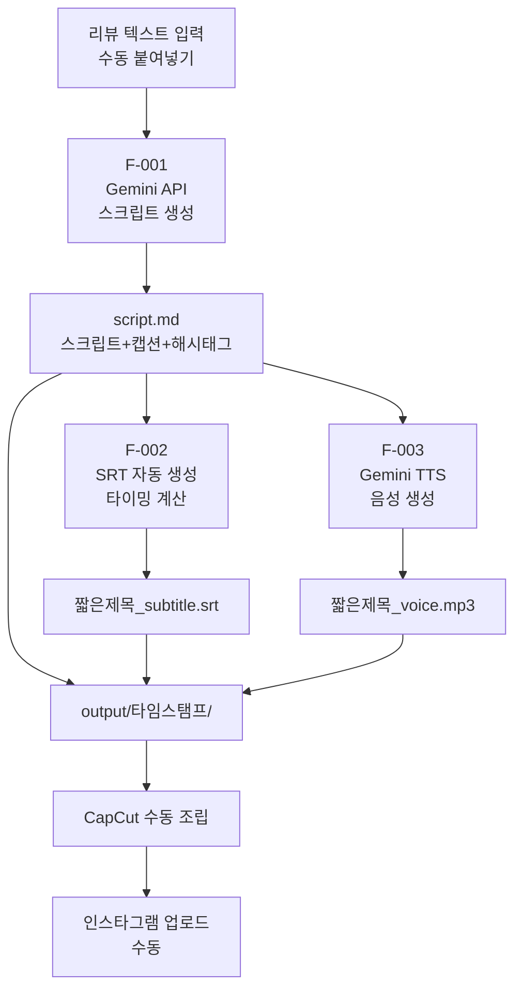
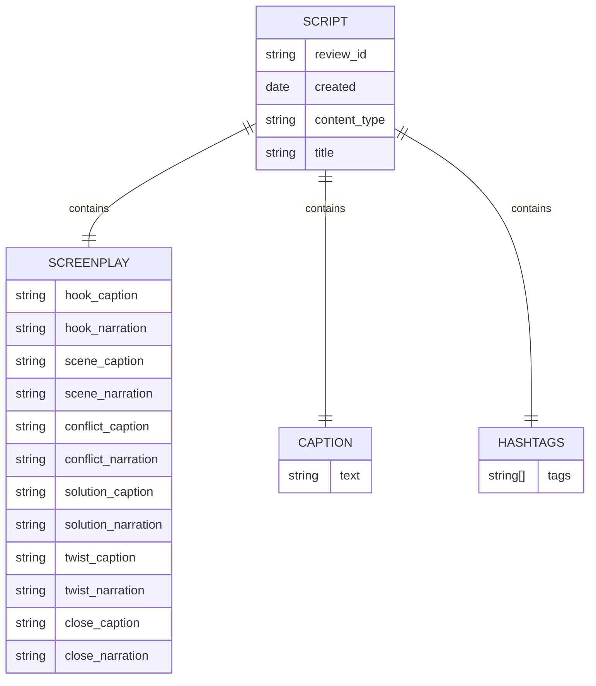

# 문장군 리뷰 기반 숏폼 콘텐츠 엔진 — PRD v1.0

## 1. Executive Summary

- **Vision Statement:** 네이버 리뷰 텍스트를 붙여넣으면, CapCut에서 바로 쓸 수 있는 script.md + SRT + MP3 패키지를 자동 생성한다.
- **Problem Space:** 리뷰 15,000개라는 압도적 자산이 네이버 안에 갇혀 있다. 이를 인스타그램 숏폼으로 꺼내는 파이프라인이 없다.
- **Target Persona & Context:** 문장군 인스타그램 운영자(1인). 리뷰를 수동으로 선별하여 붙여넣고, 생성된 파일을 CapCut으로 가져가 영상을 조립한다.

---

## 2. Jobs-to-be-Done

- **Functional Job:** 리뷰 텍스트를 넣으면 → 사연극 대본 + 자막(SRT) + 음성(MP3)이 나온다
- **Emotional Job:** "내가 직접 대본 쓰는 고통 없이 일관된 퀄리티를 유지하고 싶다"
- **Social Job:** "광고처럼 보이지 않으면서 문장군을 자연스럽게 알리고 싶다"

---

## 3. Architectural Constraints

> ⚠️ 아래 제약은 어떤 상황에서도 위배 불가

- **Tech Stack:** Python 3.11+, Google Gemini API (gemini-2.0-flash 또는 최신 모델)
- **실행 방식:** 로컬 CLI 스크립트 (추후 간단한 웹 UI 가능, MVP는 CLI)
- **입력:** 텍스트 파일(.txt) 또는 CLI 표준입력으로 리뷰 원문 전달
- **출력:** 지정 output 폴더에 3개 파일 생성 (`짧은제목_script.md` / `짧은제목_subtitle.srt` / `짧은제목_voice.mp3`)
- **API Key:** `.env` 파일에서 로드 (`GEMINI_API_KEY`)

### CRITICAL RULES
- 캡션과 해시태그는 **별도 파일로 생성 금지** — script.md 내부 섹션으로만 포함
- 자동 인스타그램 업로드 기능 구현 금지
- 리뷰 크롤링/자동 수집 기능 구현 금지
- 외부 유료 API(ElevenLabs 등)는 MVP에서 구현 금지 — Gemini TTS만 사용
- SRT 타이밍은 script.md 섹션 타임코드 기준으로 자동 생성 (수동 입력 금지)

---

## 4. Features & Execution Scope

### 🟢 Must Have — MVP

---

#### [F-001] 리뷰 입력 → 사연극 스크립트 생성

- **Context:** 핵심 기능. 이게 없으면 아무것도 없다.
- **입력:** 리뷰 원문 텍스트 (한국어, 50~500자 내외)
- **처리:** Gemini API 호출 → 사연극 6단계 구조 + 캡션 + 해시태그 포함 script.md 생성

**스크립트 구조 (6단계):**
```
[HOOK]      0~3초   사건형 제목 (상품명 아님)
[SCENE]     3~7초   일상적 상황 시작
[CONFLICT]  7~12초  문제 확대 ("그런데"로 전환)
[SOLUTION]  12~18초 시공 후 자연스러운 전환
[TWIST]     18~25초 반전/펀치라인
[CLOSE]     25~35초 실제 리뷰 원문으로 마무리 + "문장군 리뷰에서 가져왔어요" 삽입
```

**Machine-Verifiable Criteria:**
```
Given 리뷰 원문 텍스트가 입력되었을 때
When 스크립트 생성 명령을 실행하면
Then script.md 파일이 생성되고
  And 파일 내 [HOOK] ~ [CLOSE] 6개 섹션이 모두 존재하며
  And [캡션] 섹션과 [해시태그] 섹션이 파일 내에 포함되고
  And "문장군 리뷰에서 가져왔어요" 문장이 [CLOSE] 섹션에 포함되며
  And 금지 표현("여러분~", "안녕하세요~", "고객님께서는~")이 없다
```

---

#### [F-002] SRT 자막 파일 자동 생성

- **Context:** CapCut에 직접 임포트하기 위한 자막 파일. script.md의 각 섹션 타이밍에 맞춰 생성.
- **입력:** script.md (F-001 결과물)
- **처리:** 각 섹션의 자막 텍스트를 추출하고 예상 발화/노출 시간 자동 계산 → SRT 형식으로 출력

**입력 계약:**
- SRT는 `script.md`의 **자막 텍스트** 기준으로 생성한다.
- `> 내레이션:` 전문을 SRT 본문으로 사용하지 않는다.
- 자막 텍스트는 앞뒤 대괄호 없이 저장되어야 한다.

**타이밍 계산 규칙:**
- script.md 섹션 헤딩의 시간대(예: `### [HOOK] 0~3초`)를 사용
- F-003 이후 실제 음성 길이가 크게 어긋나면 TTS 문장 정규화 또는 섹션 타임코드 조정
- SRT 포맷: `HH:MM:SS,mmm --> HH:MM:SS,mmm`

**Machine-Verifiable Criteria:**
```
Given script.md 파일이 존재할 때
When SRT 생성 명령을 실행하면
Then 짧은제목_subtitle.srt 파일이 생성되고
  And SRT 항목 수가 스크립트 섹션 수와 일치하며
  And 각 항목의 본문은 자막 텍스트이고 내레이션 전문이 아니며
  And 각 항목의 타임코드가 순서대로 증가하고
  And 마지막 항목의 종료 시간이 40초를 초과하지 않는다
```

---

#### [F-003] TTS 음성 파일 생성

- **Context:** CapCut에 직접 임포트하기 위한 MP3 음성 파일. 진행자 캐릭터 프롬프트 적용.
- **입력:** script.md의 내레이션 텍스트 추출
- **처리:** persona.txt + TTS 지시문 + 내레이션 정규화 텍스트로 Gemini 최신 공식 TTS API 호출 → 짧은제목_voice.mp3 생성

**입력 계약:**
- TTS는 `script.md`의 **내레이션 텍스트** 기준으로 생성한다.
- 필요 시 `tts_text`를 별도로 정규화할 수 있다.
- 정규화는 발음/띄어쓰기 수준에서 사람 말처럼 자연스럽게 만드는 목적이다.
- 시간에 맞추기 위해 내용을 요약하거나 삭제하지 않는다. 길이는 말 속도/오디오 속도 조정으로 맞춘다.
- 말 속도는 리뷰2 레퍼런스 음원 기준(공백 제외 244자 / 35.02초 / 초당 약 6.97자)으로 고정한다.
- 내레이션 글자수는 품질 우선이며, 글자수만으로 실패 처리하지 않는다.
- 의미 변경이나 사실 추가는 금지한다.
- 현재 구현 모델은 `gemini-3.1-flash-tts-preview`이며, Stable 모델이 제공되면 교체 가능하다.

**진행자 캐릭터 프롬프트 (고정값):**
```
30대 후반 여성. 따뜻하고 친근한 한국어.
친구에게 실제 후기를 들려주듯 자연스럽게.
과장된 광고 톤 금지. 약간의 미소가 느껴지는 목소리.
말 속도는 보통보다 빠르게. 인스타 릴스처럼 리듬감 있게.
레퍼런스 속도는 리뷰2 음원 기준, 공백 제외 244자를 약 35초에 읽는 템포.
자막이 함께 보이므로 느릿느릿 설명하지 않는다.
문장 끝을 과장하지 않는다.
과도한 감정 연기 금지.
홈쇼핑 성우, 뉴스 앵커, ARS 안내음, 유튜브 AI 낭독 톤 금지.
```

**TTS 성공 기준:**
```
실패: 홈쇼핑 성우 / 뉴스 앵커 / ARS 안내음 / 유튜브 AI 낭독
성공: 카페에서 친구에게 "이 리뷰 진짜 웃기더라" 하고 말해주는 느낌
```

**Machine-Verifiable Criteria:**
```
Given script.md의 내레이션 텍스트가 추출되었을 때
When TTS 생성 명령을 실행하면
Then 짧은제목_voice.mp3 파일이 생성되고
  And 파일 크기가 0바이트가 아니며
  And 음성 길이가 SRT 마지막 타임코드 ±3초 범위 내이고
  And 파일이 CapCut에서 임포트 가능한 MP3 포맷이며
  And persona.txt의 진행자 캐릭터 기준이 적용된다
```

---

#### [F-004] 통합 실행 (원클릭 패키지 생성)

- **Context:** F-001~F-003을 순서대로 실행하여 3개 파일을 한 번에 생성
- **입력:** 리뷰 텍스트 파일 경로
- **처리:** F-001 → F-002 → F-003 순차 실행
- **출력:** `output/{리뷰묶음}/짧은번호_짧은라벨_YYYYMMDD_HHMMSS/` 폴더에 3개 파일 저장

**출력 파일 구조:**
```
output/
└── inbox_20260609/
    └── 010_구축소음_20260609_095709/
        ├── 010_구축소음_script.md       ← 스크립트 + 캡션 + 해시태그
        ├── 010_구축소음_subtitle.srt    ← 자막
        └── 010_구축소음_voice.mp3       ← 음성
```

**Machine-Verifiable Criteria:**
```
Given 리뷰 텍스트와 source-bound 사진검수·PD 승인 package가 존재할 때
When python generate.py --input review.txt --approval-package "<승인 package>" 를 실행하면
Then output/{리뷰묶음}/번호_짧은라벨_타임스탬프/ 폴더가 생성되고
  And 번호_짧은라벨_script.md, 번호_짧은라벨_subtitle.srt, 번호_짧은라벨_voice.mp3 3개 파일이 모두 존재하며
  And 전체 실행 시간이 60초 이내이다
```

---

#### [F-005] script.md 표준 포맷

**캡션 + 해시태그는 script.md 내 하단 섹션으로만 포함:**

```markdown
---
review_id: [리뷰 원문 첫 10자]
created: YYYY-MM-DD
content_type: 사연극
---

# [사건형 제목]

## 스크립트

### [HOOK] 0~3초
자막 텍스트
> 내레이션: "[음성 대본]"

### [SCENE] 3~7초
자막 텍스트
> 내레이션: "[음성 대본]"

### [CONFLICT] 7~12초
자막 텍스트
> 내레이션: "[음성 대본]"

### [SOLUTION] 12~18초
자막 텍스트
> 내레이션: "[음성 대본]"

### [TWIST] 18~25초
자막 텍스트
> 내레이션: "[음성 대본]"

### [CLOSE] 25~35초
자막 텍스트
> 내레이션: "[음성 대본] 문장군 리뷰에서 가져왔어요."

---

## 캡션
[릴스 업로드 시 사용할 캡션 — 2~3줄, 광고 톤 금지]

## 해시태그
[해시태그 — INSTAGRAM_HASHTAG_BANK.md 기준, 10~15개]
```

**Machine-Verifiable Criteria:**
```
Given script.md가 생성되었을 때
When 파일 내용을 확인하면
Then ## 스크립트, ## 캡션, ## 해시태그 섹션이 모두 존재하고
  And 자막 텍스트와 내레이션 텍스트가 섹션별로 분리되어 있으며
  And 자막 텍스트는 앞뒤 대괄호 없이 작성되어 있으며
  And 해시태그가 # 기호로 시작하는 형식이다
```

---

### 🟡 Should Have — v1.1

- **[F-101] 리뷰 사연성 채점기** — 리뷰 텍스트를 넣으면 사연성/공감성/후킹성/반전성 0~3점 루브릭으로 자동 점수 산출. Phase 0 Task 2 자동화.
- **[F-102] 배치 처리** — 리뷰 여러 개를 CSV로 입력 → 일괄 패키지 생성
- **[F-103] 간단한 웹 UI** — 텍스트 입력창 + 생성 버튼 + 파일 다운로드 인터페이스

---

### 🔴 Explicitly Out-of-Scope

> ⛔ 어떤 상황에서도 구현하지 않는다

- **[X-001] 캡션/해시태그 별도 파일 생성:** script.md 하단 섹션으로만 포함. 독립 파일 생성 금지.
- **[X-002] 인스타그램 자동 업로드:** 업로드는 사용자가 수동으로 진행. API 연동 구현 금지.
- **[X-003] 네이버 리뷰 크롤링/자동 수집:** 입력은 항상 사용자가 수동으로 붙여넣기.
- **[X-004] ElevenLabs 또는 외부 TTS 연동:** MVP는 Gemini TTS만 사용. 외부 TTS 구현 금지.
- **[X-005] 영상 편집 자동화:** CapCut 편집은 사용자 수동 작업. 영상 생성 코드 구현 금지.
- **[X-006] 사용자 계정/로그인 시스템:** 단일 사용자 로컬 도구. 인증 시스템 불필요.
- **[X-007] 데이터베이스 저장:** 리뷰 이력 DB 구축 금지. 파일 시스템 출력만.

---

## 5. Topological Context

### 5.1 System Flow



### 5.2 script.md 데이터 구조



### 5.3 디렉토리 구조

```
문장군 컨텐츠/
├── generate.py          # 메인 실행 스크립트 (F-004)
├── prompts/
│   ├── screenplay.txt   # 스크립트 생성 프롬프트 템플릿
│   └── persona.txt      # TTS 진행자 캐릭터 프롬프트 (고정)
├── output/
│   ├── pilot/
│   │   └── 002_택배고양이_YYYYMMDD_HHMMSS/
│   │       ├── 002_택배고양이_script.md
│   │       ├── 002_택배고양이_subtitle.srt
│   │       └── 002_택배고양이_voice.mp3
│   └── inbox_YYYYMMDD/
│       └── 010_구축소음_YYYYMMDD_HHMMSS/
│           ├── 010_구축소음_script.md
│           ├── 010_구축소음_subtitle.srt
│           └── 010_구축소음_voice.mp3
├── reviews/             # 입력 리뷰 텍스트 파일 보관
├── .env                 # GEMINI_API_KEY
├── requirements.txt     # google-generativeai, python-dotenv
├── PROJECT_BRIEF.md
└── PRD_v1.0.md
```

---

## 6. AI Evals & Quality Gates

- [ ] **EVAL-01:** `python generate.py --input [파일] --approval-package [승인 package]` 실행 시 승인 검증 후 완료되는가?
- [ ] **EVAL-02:** output 폴더에 3개 파일(짧은제목_script.md / 짧은제목_subtitle.srt / 짧은제목_voice.mp3)이 생성되는가?
- [ ] **EVAL-03:** script.md에 [HOOK]~[CLOSE] 6섹션 + 캡션 + 해시태그 섹션이 모두 있는가?
- [ ] **EVAL-04:** "여러분~", "안녕하세요~", "고객님께서는~" 금지 표현이 없는가?
- [ ] **EVAL-05:** "문장군 리뷰에서 가져왔어요" 청각 앵커 문장이 [CLOSE]에 있는가?
- [ ] **EVAL-06:** SRT 마지막 타임코드가 40초 이내인가?
- [ ] **EVAL-07:** 짧은제목_voice.mp3가 CapCut에서 임포트 가능한가?
- [ ] **EVAL-08:** 캡션/해시태그가 별도 파일로 생성되지 않았는가? (X-001 준수)
- [ ] **EVAL-09:** 전체 실행 시간이 60초 이내인가?

---

## 7. Implementation Phases

### Phase 0: 사연성 검증 (파일럿) — 시스템 구축 전 필수

> 이 Phase가 통과되어야 Phase 1~3을 진행한다.

- [ ] 네이버 브랜드스토어 리뷰 200개 수동 추출 → `reviews/pilot/` 저장
- [ ] AI에 루브릭 기준으로 사연성 점수 분류 요청
  ```
  루브릭: 사연성(0-3) + 공감성(0-3) + 후킹성(0-3) + 반전성(0-3) = 최대 12점
  A급: 9점 이상 / B급: 6~8점 / C급: 3~5점 / 제외: 0~2점
  ```
- [ ] **GO 기준: A급 30개 이상** 확인
- [ ] A급 상위 20개 선정 (카테고리 균형: 반려동물/아이/소음/반전)
- [ ] AppSheet에서 시공 전/후 사진 매칭 가능 여부 확인
- [ ] **GO 확정 시 → Phase 1 진입**

---

### Phase 1: 기반 설정

- [ ] 프로젝트 폴더 구조 생성 (5.3 기준)
- [ ] `requirements.txt` 작성 및 패키지 설치
  ```
  google-generativeai
  python-dotenv
  ```
- [ ] `.env` 파일 생성 (`GEMINI_API_KEY=` 입력란)
- [ ] `prompts/screenplay.txt` 작성 — 사연극 6단계 구조 + 금지 표현 + 필수 포함 문장 명시
- [ ] `prompts/persona.txt` 작성 — TTS 진행자 캐릭터 프롬프트 저장

---

### Phase 2: 핵심 기능 구현

- [ ] **[F-001]** `generate.py` — 리뷰 텍스트 입력 → Gemini API → script.md 생성
- [ ] **[F-005]** script.md 표준 포맷 템플릿 적용 및 검증 로직
- [ ] **[F-002]** SRT 자동 생성 함수 — 자막 텍스트 + 섹션 타임코드 기반
- [ ] **[F-003]** Gemini TTS API 호출 → 짧은제목_voice.mp3 저장
- [ ] **[F-004]** 통합 실행 `--input` 옵션으로 원클릭 패키지 생성

---

### Phase 3: 검증 및 파일럿 제작

- [ ] EVAL-01~09 체크리스트 전수 검사
- [ ] A급 리뷰 20개로 실제 패키지 생성 테스트
- [ ] CapCut 임포트 (짧은제목_subtitle.srt + 짧은제목_voice.mp3) 정상 작동 확인
- [ ] 릴스 10개 실제 제작 및 업로드
- [ ] 제작 시간 측정 (목표: 1편 60분 이내)
- [ ] 2주 성과 측정 후 KPI 1~5차 지표 기록

---

## 8. 브랜드 가이드라인 (스크립트 생성 시 필수 준수)

### 진행자 캐릭터
- 30대 후반 여성, 리뷰 큐레이터 포지션
- 문장군 직원 아님 — 리뷰를 좋아해서 모아 읽어주는 제3자

### 세계관 앵커
- 시리즈명: **문장군 리뷰 보관함** (또는 문장군 실화사전)
- 청각 앵커: [CLOSE] 섹션에 "문장군 리뷰에서 가져왔어요" 반드시 포함

### 스크립트 금지 표현
```
❌ "여러분~"  "안녕하세요~"  "오늘의 사연입니다~"  "고객님께서는~"
❌ "물론" "또한" "더불어" "이처럼" "효과적입니다" (AI 냄새)
❌ "보양 작업"  "하루 20개 시공"  구체적 가격 수치
```

### 스크립트 권장 표현
```
✅ "이건 좀 웃겼어요."  "저도 이건 이해되더라고요."
✅ "이 리뷰는 저장해두셔도 좋을 것 같아요."
✅ "집사님들은 공감하실 듯."  "아이 키우는 집은 더 공감될 듯."
```

### 문장군 브랜드 팩트 (스크립트 활용 가능)
- 리뷰 15,000개 / 플레이스 예약리뷰 4,000개
- 전속 시공팀 3팀, 최대 35현장/일
- 중문 결정 후 3~4일 / 도어 1주일 내 시공
- 도어 A/S 3년 / 중문 A/S 2년
- 무료 방문실측 (레이저 레벨기 + 샘플북)

---

## 9. KPI (Phase 0 기준)

| 단계 | 지표 | Phase 0 목표 |
|------|------|-------------|
| 1차 | 업로드 수 | 10편 |
| 2차 | 릴스 평균 조회수 | 팔로워 대비 3배 이상 |
| 3차 | 프로필 방문율 | 조회수 대비 5% |
| 4차 | DM 문의 수 | 월 5건 |
| 5차 | 인스타 보고 실측 예약 | 월 2건 |

---

## 참조 파일

- [PROJECT_BRIEF.md](./PROJECT_BRIEF.md) — 전략 브리프
- [BRAND_CONTEXT.md](./BRAND_CONTEXT.md) — 문장군 브랜드 전략
- `C:\Users\hjh\안티그래비티\문장군 인스타그램\INSTAGRAM_HASHTAG_BANK.md` — 해시태그 뱅크
- `C:\Users\hjh\안티그래비티\문장군 인스타그램\INSTAGRAM_CONTENT_STRATEGY.md` — 콘텐츠 전략
